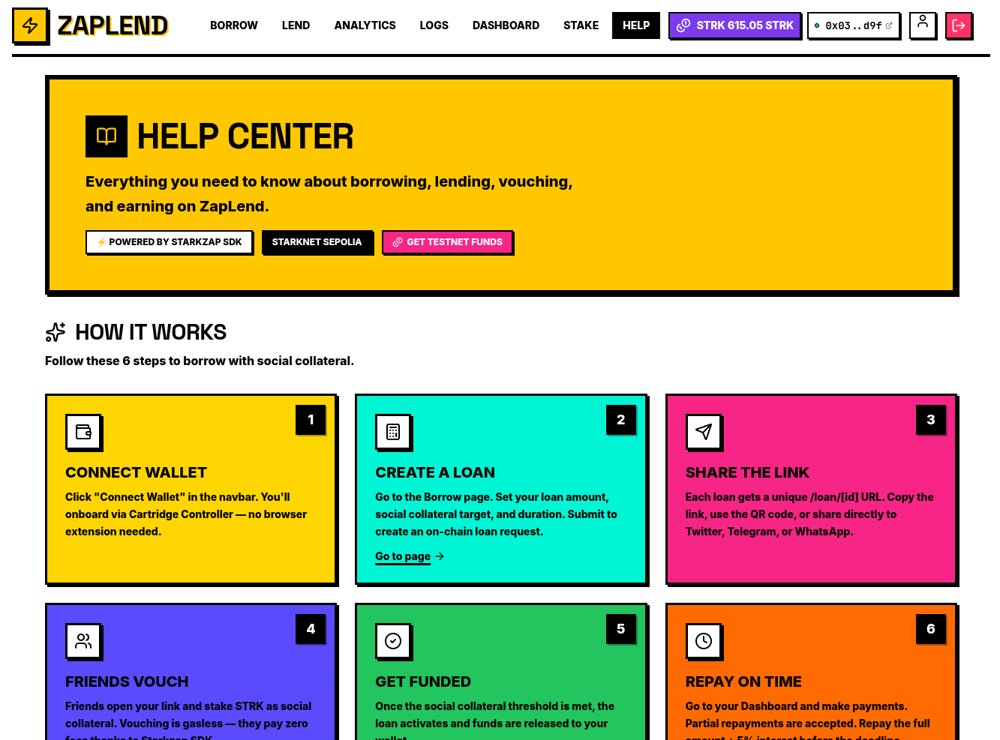
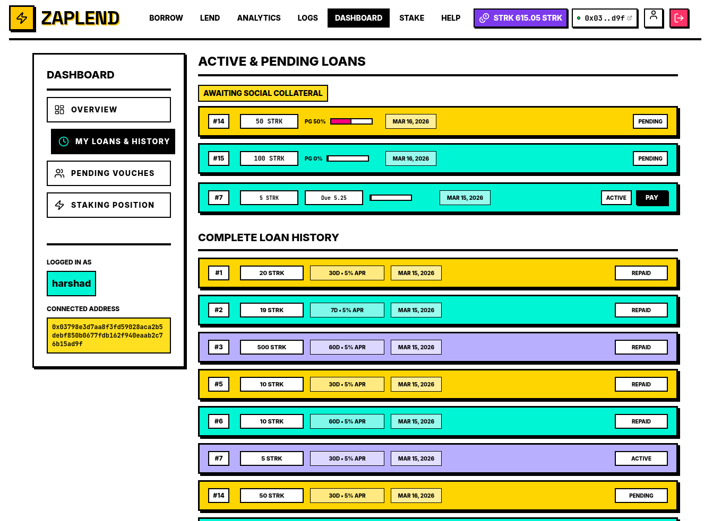
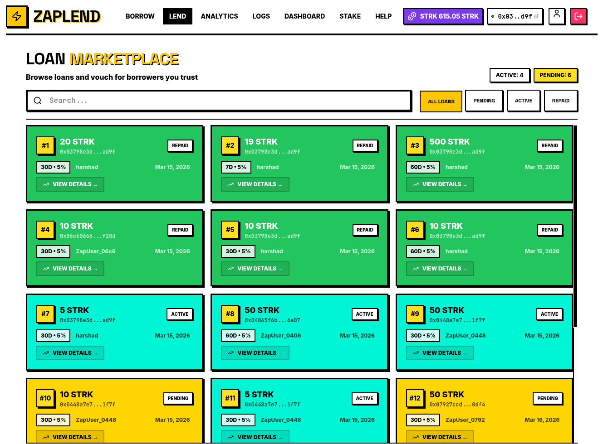
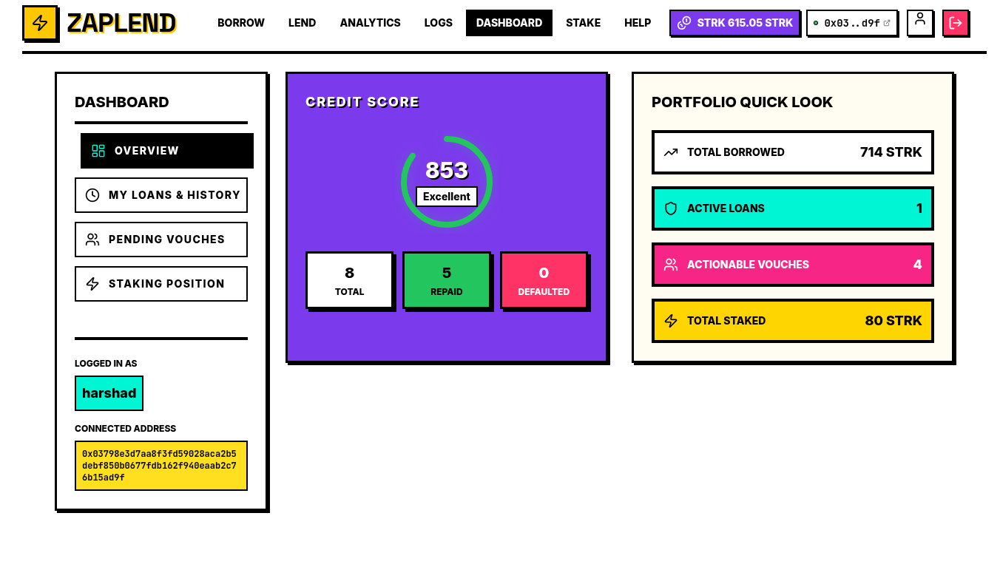
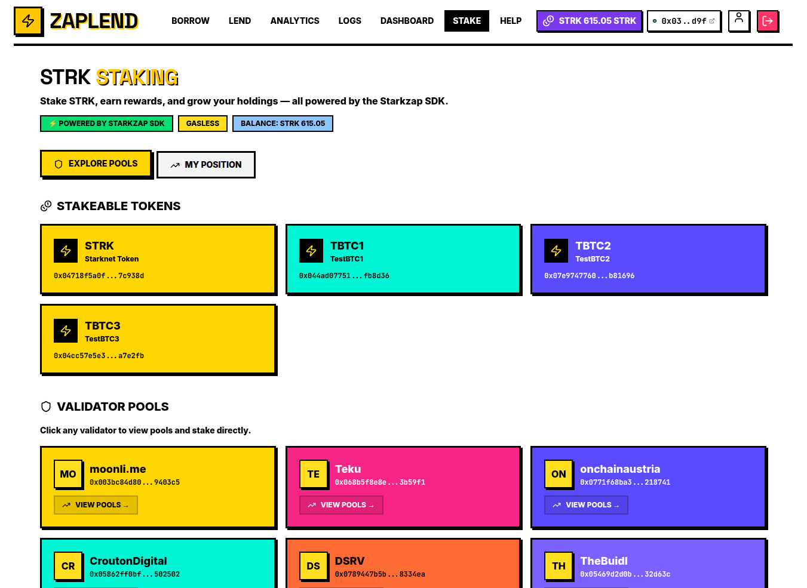
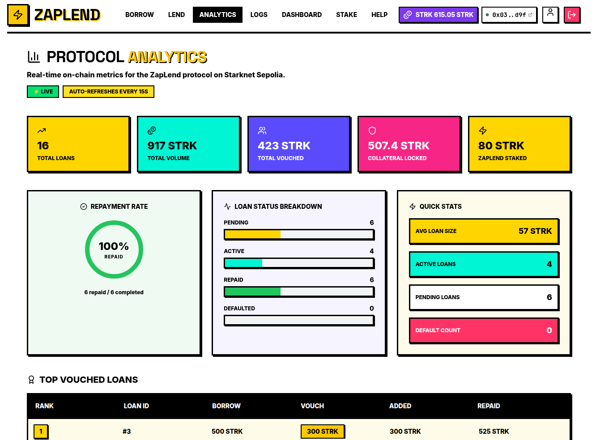
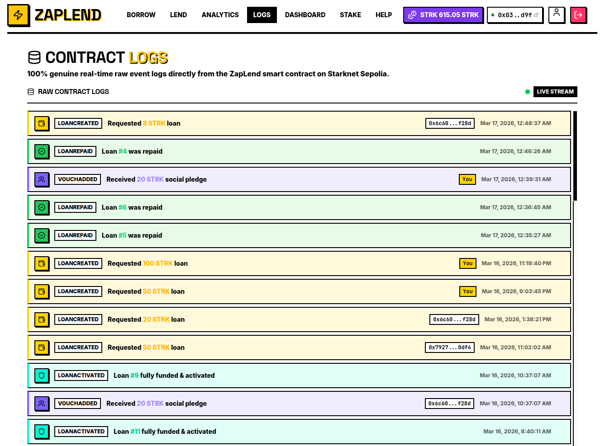

# ZapLend User Guide: Mastering Social Collateral

Welcome to ZapLend! This comprehensive guide will walk you through everything you need to know to start borrowing, lending, staking, and earning with the power of social trust on Starknet.

---

## Table of Contents

1. [Getting Started](#1-getting-started)
2. [Borrowing with Social Collateral](#2-borrowing-with-social-collateral)
3. [Lending & Vouching](#3-lending--vouching)
4. [Managing Your Dashboard](#4-managing-your-dashboard)
5. [Staking STRK](#5-staking-strk)
6. [Understanding Analytics](#6-understanding-analytics)
7. [Contract Logs & Transparency](#7-contract-logs--transparency)
8. [FAQs & Troubleshooting](#8-faqs--troubleshooting)

---

## 1. Getting Started

### 1.1 Onboarding: Wallet Connection

ZapLend is built on the **Starkzap SDK**, which means you don't need to worry about complex browser extensions or seed phrases.

**Steps:**
1. Visit [https://zaplend.vercel.app/](https://zaplend.vercel.app/)
2. Click **"Connect Wallet"** in the top right corner
3. A Cartridge Controller popup will appear
4. Login using your passkey (Face ID/Fingerprint) or email
5. Your wallet is now connected!



### 1.2 Getting Testnet STRK

Since ZapLend runs on Starknet Sepolia testnet, you'll need test tokens:

1. Visit the [Starknet Faucet](https://faucet.starknet.io/)
2. Enter your Cartridge wallet address (shown in the navbar)
3. Request test STRK tokens
4. Wait for confirmation (usually within minutes)

> **Tip:** You can also get testnet ETH from the [Starknet Goerli Faucet](https://faucet.goerli.starknet.io/) for gas fees, though Starkzap's Paymaster often covers these.

---

## 2. Borrowing with Social Collateral

### 2.1 What is Social Collateral?

Traditional DeFi loans require 120% collateral. With Social Collateral:
- You deposit a baseline amount
- Friends can "vouch" for you by staking their STRK
- This reduces your personal collateral requirement
- **Example:** Borrow 1,000 STRK → Need 1,200 STRK collateral → Friends vouch 400 STRK → You only deposit 800 STRK (33% savings!)

### 2.2 Creating a Loan Request

1. **Navigate to Borrow**: Click [Borrow](https://zaplend.vercel.app/borrow) in the navbar

2. **Set Your Terms:**
   - **Loan Amount**: How much STRK you need (e.g., 1000 STRK)
   - **Social Collateral Target**: How much you want friends to cover (e.g., 400 STRK)
   - **Duration**: Choose 7, 14, 30, or 60 days
   - **Interest**: Fixed 5% on all loans

3. **Review Collateral:**
   - Total Required: 120% of loan amount
   - Your Deposit: Total Required - Social Target
   - Platform shows exact amounts before confirmation

4. **Submit Transaction:**
   - Confirm via Cartridge Controller
   - Your STRK will be deposited as initial collateral
   - Loan enters the marketplace with `Pending` status



### 2.3 Sharing Your Loan Request

Once created, your loan gets a unique URL:
- **Direct Link**: `https://zaplend.vercel.app/loan/[id]`
- **QR Code**: Generate from the loan detail page
- **Social Share**: One-click sharing to Twitter, Telegram, WhatsApp

**Best practices for sharing:**
- Share with friends who trust you financially
- Explain the vouching process
- Set realistic social collateral targets (30-50% is typical)
- Be responsive to questions about repayment

---

## 3. Lending & Vouching

### 3.1 Exploring the Marketplace

1. **Go to Lend**: Visit the [Lend](https://zaplend.vercel.app/lend) page
2. **Browse Loans**: See all active and pending loan requests
3. **Filter & Search:**
   - **Status Filter**: Active, Pending, Repaid, Defaulted
   - **Search**: Find loans by borrower address
   - **Sort**: By amount, collateral, or time remaining



### 3.2 Vouching for a Friend

When you find a loan you want to support:

1. **Click "Vouch"** on any `Pending` loan
2. **Enter Amount**: How much STRK you want to stake
3. **Review Terms**:
   - Your staked STRK acts as collateral for the borrower
   - If they default, your stake is at risk
   - You earn trust/reputation for successful vouches
   - 💰 **Interest Rewards**: The interest generated from the loan is proportionally distributed among all vouchers based on their staked amount.

4. **Confirm Transaction**:
   - ⚡ **Gasless!** Thanks to Starkzap's Paymaster, you pay 0 gas
   - Transaction processes via Cartridge Controller
   - Your vouch is recorded on-chain


### 3.3 Loan Activation

A loan activates when:
- Social collateral target is met (sum of all vouches)
- Total collateral reaches 120% of loan amount
- Funds are automatically disbursed to borrower
- Status changes from `Pending` → `Active`

---

## 4. Managing Your Dashboard

### 4.1 Dashboard Overview

Your [Dashboard](https://zaplend.vercel.app/dashboard) is your personal command center:

**Stats Cards:**
- **Total Borrowed**: Sum of all your active loans
- **Active Vouches**: STRK you've staked for others
- **Credit Score**: Your on-chain reputation (300-1000)



### 4.2 Your Loans

**Active Loans:**
- See all loans you've created
- **Make Payment**: Repay principal + interest
- Partial repayments supported
- Track remaining time until deadline

**Vouched Loans:**
- Loans you've supported
- Monitor borrower's repayment progress
- Withdraw vouches (only before activation)

### 4.3 Repayment Process

1. Go to Dashboard → Active Loans
2. Click **"Make Payment"**
3. Enter amount (can be partial)
4. Confirm via Cartridge
5. Repayment recorded on-chain

**Important:**
- Total repayment = Principal + 5% interest
- Must be fully repaid before deadline
- Late repayments risk liquidation

### 4.4 Credit Score

Your credit score (300-1000) is calculated based on:
- **Loans Created**: +10 points per loan
- **Repaid on Time**: +50 points per successful repayment
- **Defaults**: -100 points per default

Higher scores = More trust from the community = Easier to get vouches.

---

## 5. Staking STRK

ZapLend integrates native STRK staking via the **Starkzap SDK**, allowing you to earn yield while your tokens aren't being used for loans.

### 5.1 Exploring Validator Pools

1. **Go to Stake**: Visit the [Stake](https://zaplend.vercel.app/stake) page
2. **Browse Validators**: See available validators from SDK presets
3. **View Pools**: Each validator may have multiple token pools
4. **Compare Metrics**: Total staked, commission rates



### 5.2 Staking Your STRK

1. **Select a Validator**: Click on any validator card
2. **Choose a Pool**: View their active delegation pools
3. **Click "Stake"**: Enter the amount of STRK
4. **Confirm**: Transaction via Cartridge Controller

**SDK Method Used:**
```typescript
const tx = await wallet.stake(poolAddress, amount);
await tx.wait();
```

### 5.3 Managing Your Position

**My Position Tab:**
- **Staked**: Total STRK delegated
- **Rewards Earned**: Accumulated staking rewards
- **Total Value**: Staked + Rewards
- **Commission**: Validator fee percentage

**Actions:**
- **Stake More**: Add to existing position
- **Claim Rewards**: Withdraw accumulated rewards anytime
- **Unstake**: Initiate withdrawal (requires cooldown)

### 5.4 Unstaking Process

Unstaking is a two-step process:

1. **Exit Intent**: Declare your withdrawal amount
   - Starts cooldown period (network-defined)
   - Tokens marked as "unpooling"

2. **Complete Withdrawal**: After cooldown
   - Finalize withdrawal
   - STRK returned to wallet
   - Rewards stop accruing

**SDK Methods:**
```typescript
// Step 1: Declare intent
await wallet.exitPoolIntent(poolAddress, amount);

// Step 2: Complete after cooldown
await wallet.exitPool(poolAddress);
```

---

## 6. Understanding Analytics

The [Analytics](https://zaplend.vercel.app/analytics) page provides protocol-wide insights:

### 6.1 Platform Metrics

- **Total Value Locked (TVL)**: All STRK in the protocol
- **Total Loans**: Cumulative loans created
- **Active Loans**: Currently borrowed funds
- **Total Borrowers**: Unique addresses
- **Total Vouches**: Social collateral staked



### 6.2 Loan Performance

**Top Loans Table:**
- Loan ID and borrower
- Amount borrowed
- Collateral deposited
- Amount repaid (if any)
- Status tracking

### 6.3 Credit Score Distribution

Visual breakdown of user credit scores:
- **Excellent (800-1000)**: Trusted borrowers
- **Good (650-799)**: Reliable borrowers
- **Fair (500-649)**: New or mixed history
- **Poor (300-499)**: Defaults or new users

---

## 7. Contract Logs & Transparency

ZapLend believes in full on-chain transparency. The [Logs](https://zaplend.vercel.app/logs) page shows real-time events:

### 7.1 Event Types

| Event | Description |
|-------|-------------|
| `LoanCreated` | New loan request submitted |
| `VouchAdded` | Friend staked STRK as social collateral |
| `LoanActivated` | Social target met, funds disbursed |
| `LoanRepaid` | Borrower made repayment |
| `LoanDefaulted` | Deadline passed without full repayment |

### 7.2 Log Details

Each log entry shows:
- **Transaction Hash**: Link to Voyager explorer
- **Block Number**: On-chain confirmation
- **Timestamp**: When event occurred
- **Event Data**: Loan ID, addresses, amounts



---

## 8. FAQs & Troubleshooting

### Frequently Asked Questions

**Q: What happens if I don't repay my loan?**
A: If the deadline passes without full repayment, anyone can trigger liquidation. Your collateral AND your friends' vouched STRK will be seized.

**Q: Is my money safe when vouching?**
A: Vouching carries risk — only vouch for people you trust. If they default, your staked STRK is lost.

**Q: Why is vouching gasless?**
A: Starkzap's Paymaster sponsors the transaction, making it free for vouchers.

**Q: Can I withdraw my vouch?**
A: Only before the loan activates. Once active, your stake is locked until repayment or liquidation.

**Q: What's the interest rate?**
A: Fixed 5% on all loans. Borrow 1000 STRK, repay 1050 STRK.

**Q: How is Credit Score calculated?**
A: Base 300 + 10 per loan created + 50 per on-time repayment - 100 per default. Max 1000.

**Q: Can I stake and still use my STRK for loans?**
A: Staked STRK is locked. Unstake first if you need those tokens for collateral or vouching.

### Troubleshooting

**Wallet won't connect:**
- Clear browser cache
- Try incognito mode
- Check if Cartridge popup is blocked

**Transaction failing:**
- Ensure you have testnet STRK
- Check if loan is still pending (for vouching)
- Verify sufficient balance for collateral

**Staking not working:**
- Check validator pool availability
- Ensure sufficient STRK balance
- Some validators may be at capacity

**Can't see my loan:**
- Loans may take a moment to index
- Check "All" filter in marketplace
- Verify transaction succeeded on [Voyager](https://sepolia.voyager.online/)

---

## Quick Reference

| Action | Location | Gas Cost |
|--------|----------|----------|
| Connect Wallet | Navbar | Free |
| Create Loan | /borrow | Paid by user |
| Vouch for Loan | /lend or /loan/[id] | ⚡ Gasless (Paymaster) |
| Repay Loan | /dashboard | Paid by user |
| Stake STRK | /stake | Paid by user |
| Claim Rewards | /stake | Paid by user |
| View Logs | /logs | Free (read-only) |

---

## Support & Community

- **GitHub Issues**: [Report bugs](https://github.com/harshad-dhokane/ZAPLEND/issues)
- **Starkzap Discord**: [Join the community](https://discord.com/invite/starknet-community)
- **Starknet Faucet**: [Get test tokens](https://faucet.starknet.io/)

---

**Happy Lending!** 💡⚡
