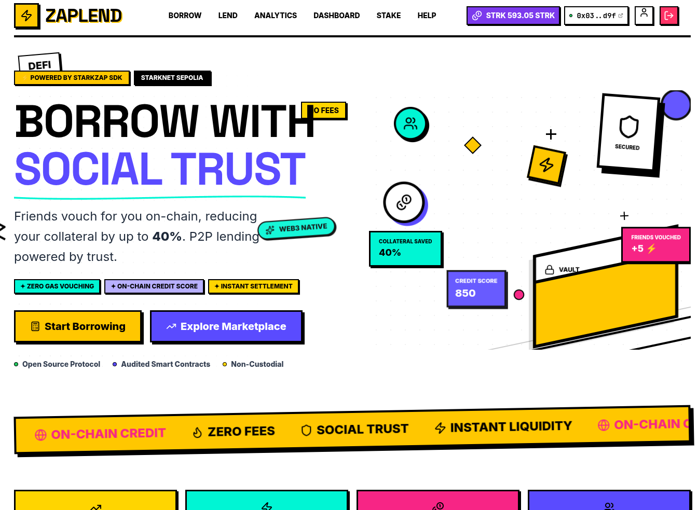
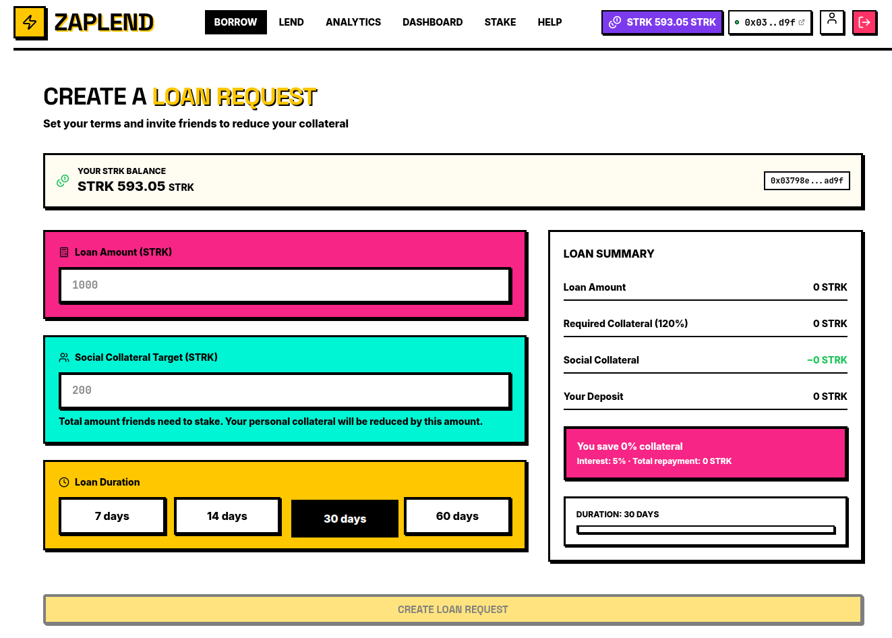
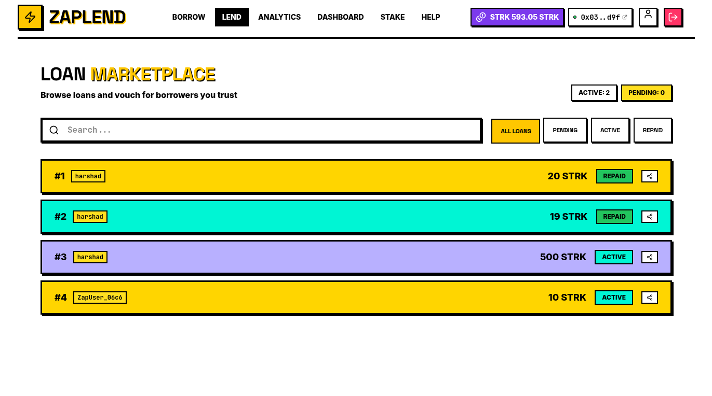
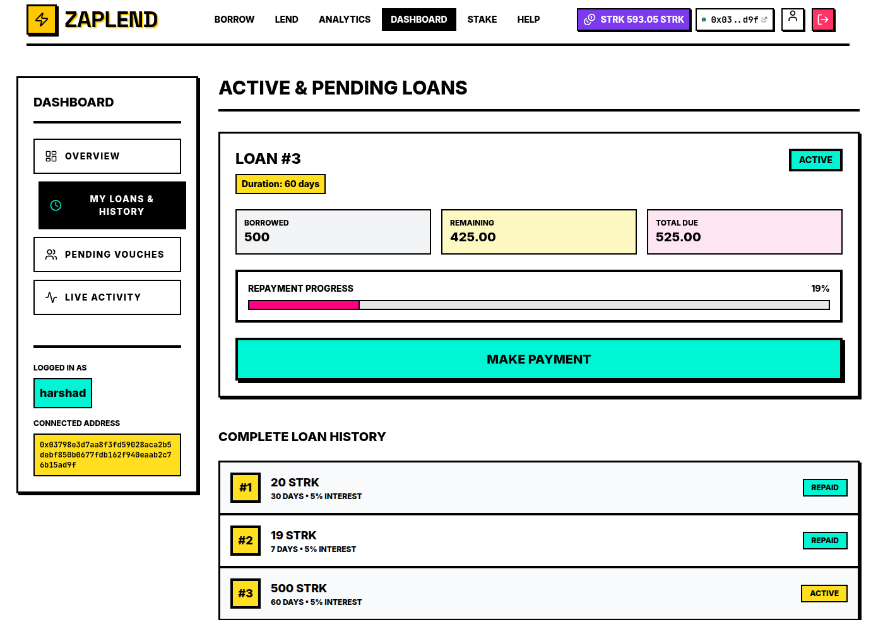
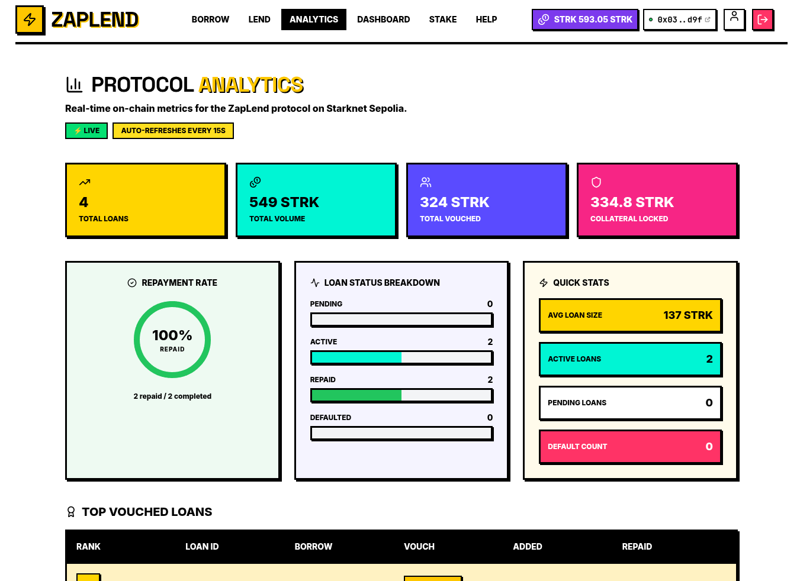

# ZapLend — Social Collateral P2P Lending

> Borrow with less collateral when friends vouch for you. Trust-based lending powered by Starknet and [Starkzap SDK](https://github.com/keep-starknet-strange/starkzap).

ZapLend re-imagines DeFi peer-to-peer lending by introducing **"Social Collateral."** Borrowers can reduce their required capital by inviting friends to essentially co-sign their loan natively on-chain.



## 🏆 Starkzap Developer Challenge Submission

ZapLend is proudly submitted to the **Starkzap Developer Challenge**. It answers the prompt: *"What if [insert SaaS/mobile app] had Bitcoin, stablecoins or DeFi features?"* by bringing **social trust and P2P lending** to Starknet DeFi.

### How it uses the Starkzap SDK:
1. **Seamless Cartridge Controller Onboarding**: Uses `StarkZap` with `OnboardStrategy.Cartridge` to allow fast wallet connections without intrusive browser extensions or seed phrases.
2. **One-Tap Gasless Vouching**: Friends can stake STRK to back borrowers instantly, without worrying about gas fees, heavily leveraging the unified Cartridge controller transaction flow via `wallet.execute()`. 
3. **Complex Payload Execution**: Aggregates multi-call transactions to handle ERC20 approvals and complex Starknet contract interactions seamlessly.

### Links
- **Live Demo App**: [https://zaplend.vercel.app/](https://zaplend.vercel.app/)
- **GitHub Repository**: [harshad-dhokane/ZAPLEND](https://github.com/harshad-dhokane/ZAPLEND)
- **Technical Guide & Architecture Blueprint**: [Read GUIDE.md](./GUIDE.md)

---

## 🌟 Features & The Flow

ZapLend features a vibrant, Neo-Brutalism UI that makes complex DeFi interactions feel like a modern consumer app.

### 1. The Borrow Request
A user connects their wallet (via Cartridge) and submits a loan request. Normally, they would need 120% collateral. In ZapLend, they can set a **Social Collateral Target**.
- They put down a baseline deposit.
- The rest of the required collateral is delegated to their social circle.



### 2. Shareable Vouching
The borrower receives a custom link to send to friends. Anyone can explore the **Loan Marketplace** to find borrowers they trust and support.



### 3. Friends Vouch (Gasless!)
Friends click **Vouch** and stake their own STRK towards the borrower's goal. Because ZapLend uses the Starkzap SDK, this transaction is heavily optimized to be fast and user-friendly.

### 4. Loan Activation & Live Activity Feed
Once the social collateral threshold is met, the loan becomes active and funds are disbursed. The **Dashboard** acts as a global timeline, tracking everything from loan creation to real-time vouching activity.



### 5. Analytics & Credit Profile
A robust Analytics dashboard tracks aggregate platform metrics, breaking down top loans by added collateral vs repaid value.



---

## 🏗️ Architecture

### Smart Contracts (Cairo)
Written entirely in modern Cairo 2.x.
| Contract | Purpose |
|----------|---------|
| `Loan` | Loan creation, collateral logic, repayment, liquidation scenarios |

[View Contract on Voyager (Sepolia)](https://sepolia.voyager.online/contract/0x04d9043def8f91491a91337fe81695c5692cc98403818b6d0029ad7105cb66f5)

### Frontend (Next.js + Starkzap)
| Layer | Technology |
|-------|------------|
| Framework | Next.js (App Router) |
| Styling | Tailwind CSS |
| State | React Query |
| Wallet | Starkzap SDK (`starkzap`) |

## 🚀 Quick Start (Local Development)

### Prerequisites
- Node.js 18+
- npm
- Starknet wallet (via Cartridge Controller)

### Frontend Setup
```bash
cd frontend
npm install
cp .env.example .env.local
# Ensure NEXT_PUBLIC_LOAN_CONTRACT_ADDRESS is set
npm run dev
```

Open [http://localhost:3000](http://localhost:3000) to see the app.

---
## 📄 License
MIT
