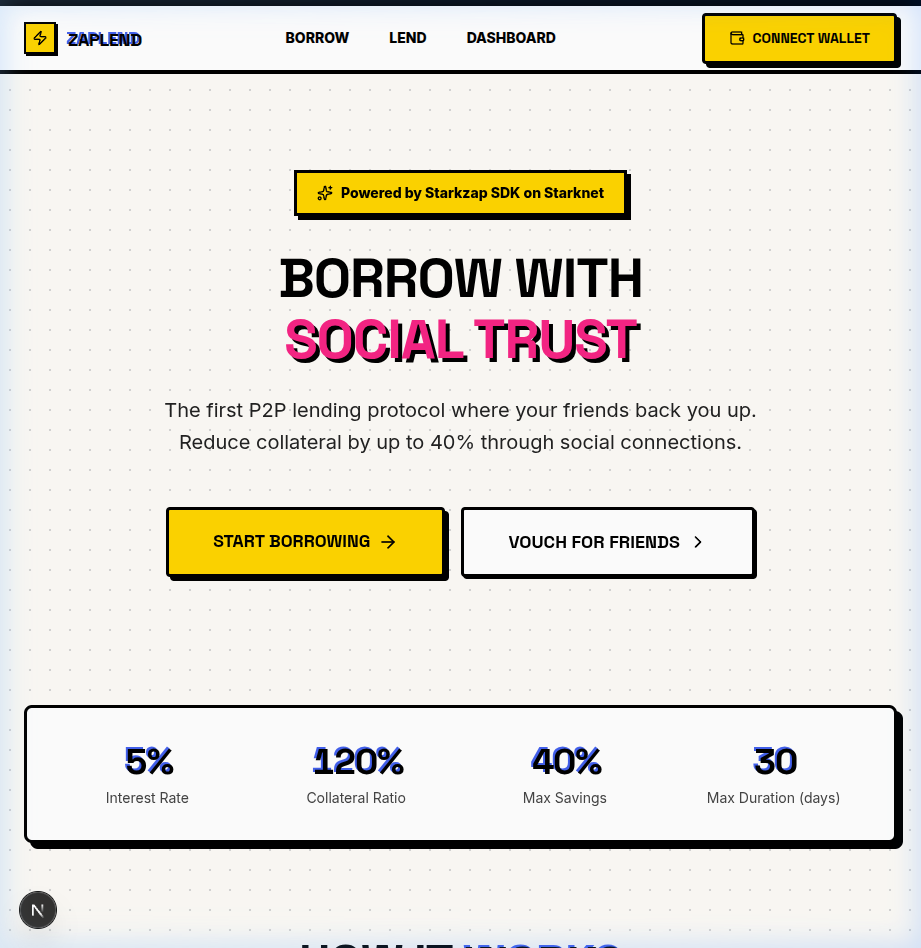
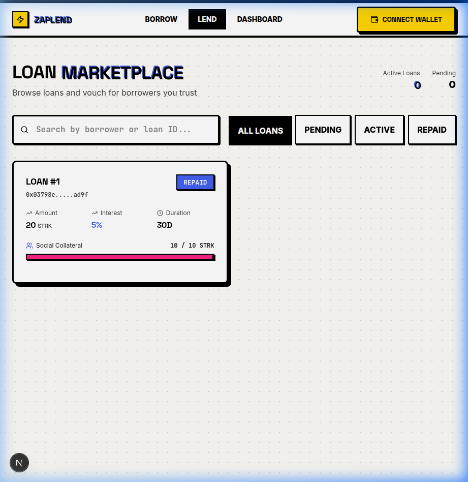

# ZapLend — Social Collateral P2P Lending

> Borrow with less collateral when friends vouch for you. Trust-based lending powered by Starknet and [Starkzap SDK](https://github.com/keep-starknet-strange/starkzap).



## 🌟 Features

- **Neo-Brutalism UI** — High contrast, bold, and entirely custom design system
- **Social Collateral** — Friends stake STRK to vouch for borrowers, reducing collateral requirements by up to 40%
- **Shareable Vouch Links** — Send a `/loan/[id]` direct link to friends so they can vouch in 1 click
- **Real-time Activity Feed** — Live timeline on the dashboard of loans, funding, defaults, and repayments
- **Gasless Vouching** — Friends vouch with zero gas fees via Starkzap SDK
- **On-chain Credit Score** — Reputation system based on repayment history


## 🏗️ Architecture

### Smart Contracts (Cairo)

| Contract | Purpose |
|----------|---------|
| `Loan` | Loan creation, collateral, repayment, liquidation |
| `SocialCollateral` | Friend stakes, vouch tracking |
| `CreditScore` | On-chain reputation |

[View Contract on Voyager (Sepolia)](https://sepolia.voyager.online/contract/0x04d9043def8f91491a91337fe81695c5692cc98403818b6d0029ad7105cb66f5)

### Frontend (Next.js + Starkzap)

| Layer | Technology |
|-------|------------|
| Framework | Next.js 16 (App Router) |
| Styling | Tailwind CSS v4 |
| State | React Query |
| Wallet | Starkzap SDK (`starkzap`) |
| Icons | Lucide React |



## 🚀 Quick Start

### Prerequisites
- Node.js 18+
- npm
- Starknet wallet (via Cartridge Controller)

### Frontend Setup

```bash
cd frontend
npm install
cp .env.example .env.local
# Update contract addresses in .env.local
npm run dev
```

Open [http://localhost:3001](http://localhost:3001) to see the app.

## 📝 Usage

1. **Connect Wallet** — Click "Connect Wallet" to authenticate via Cartridge Controller
2. **Create Loan** — Go to /borrow, set amount, social collateral, and duration
3. **Share Request** — Send the shareable vouch request link to friends
4. **Friends Vouch** — Friends visit the link and stake STRK to support you
5. **Loan Activates** — Once threshold met, funds are released to your wallet
6. **Repay** — Go to /dashboard and make payments to return collateral

## 🔗 Starkzap Integration

ZapLend uses the Starkzap SDK for:

- **Wallet Connection** — `StarkZap` class with `OnboardStrategy.Cartridge`
- **Transaction Execution** — `wallet.execute()` for contract calls
- **Gasless Transactions** — Sponsored vouching for friends

```typescript
import { StarkZap, OnboardStrategy } from 'starkzap';

const sdk = new StarkZap({ network: 'sepolia' });
const { wallet } = await sdk.onboard({
  strategy: OnboardStrategy.Cartridge,
  cartridge: { policies: [...] },
});

// Execute loan creation
await wallet.execute([{
  contractAddress: LOAN_CONTRACT,
  entrypoint: 'create_loan',
  calldata: [...],
}]);
```

## 🏆 Starkzap Developer Challenge Submission

ZapLend is proudly submitted to the **Starkzap Developer Challenge**. It explores the prompt: *"What if [insert SaaS/mobile app] had Bitcoin, stablecoins or DeFi features?"* by bringing **social trust and P2P lending** to Starknet DeFi.

### How it uses the Starkzap SDK:
1. **Seamless Cartridge Controller Onboarding**: Uses `StarkZap` with `OnboardStrategy.Cartridge` to allow fast wallet connections without intrusive browser extensions.
2. **One-Tap Gasless Vouching**: Friends can stake STRK to back borrowers instantly, without worrying about gas fees, heavily leveraging the unified Cartridge controller transaction flow via `wallet.execute()`. 
3. **Complex Payload Execution**: Aggregates multi-call transactions to handle ERC20 approvals and Starknet contract calls seamlessly.

### Links
- **GitHub Repository**: [harshad-dhokane/ZAPLEND](https://github.com/harshad-dhokane/ZAPLEND)
- **Live Demo App**: [Add Vercel URL Here]

---
## 📄 License

MIT
