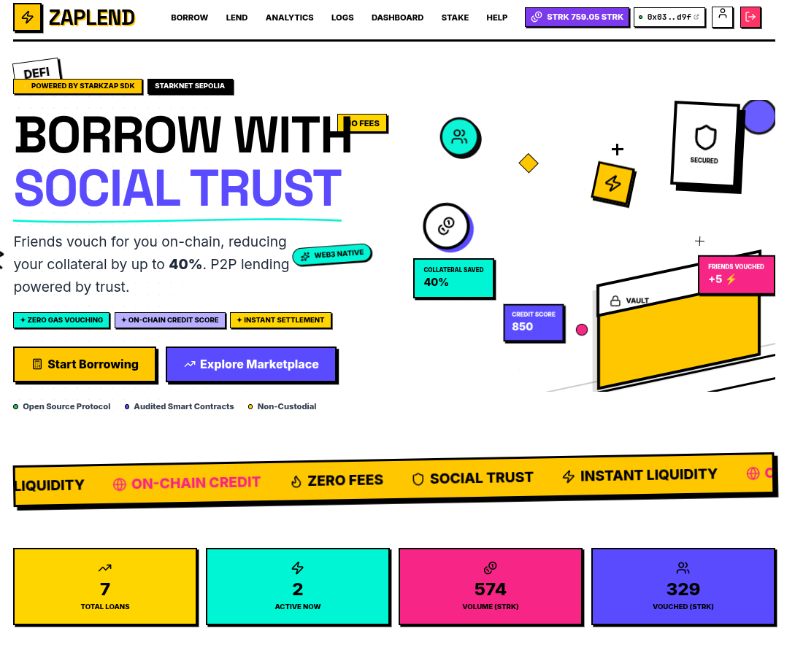
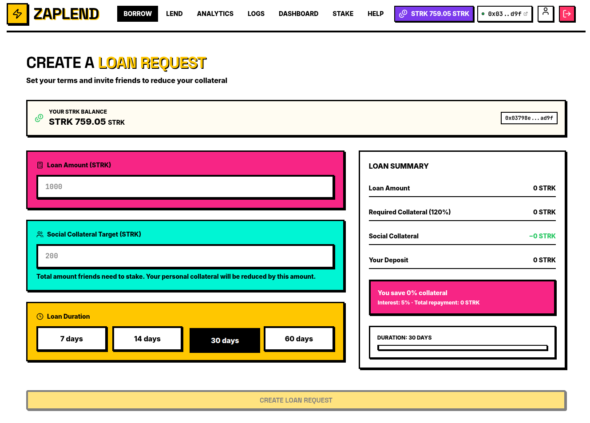
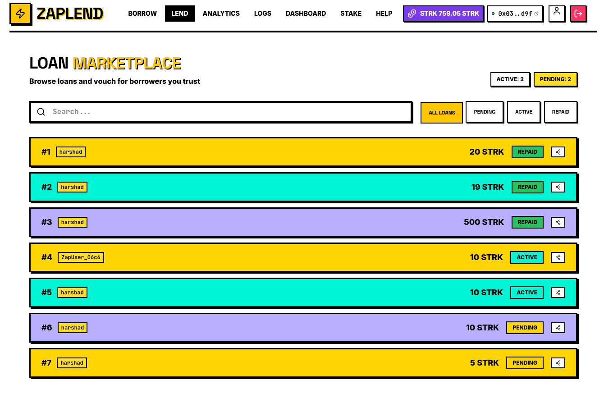
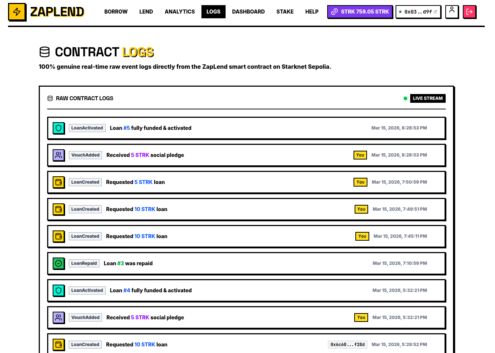
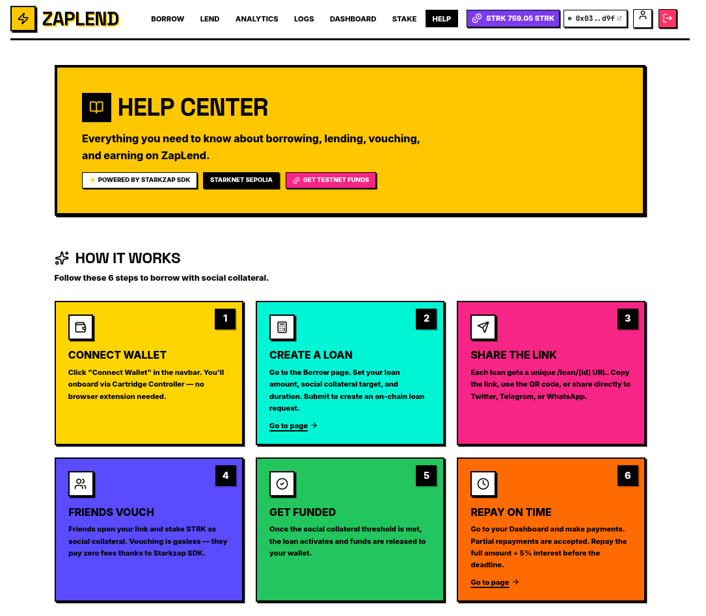
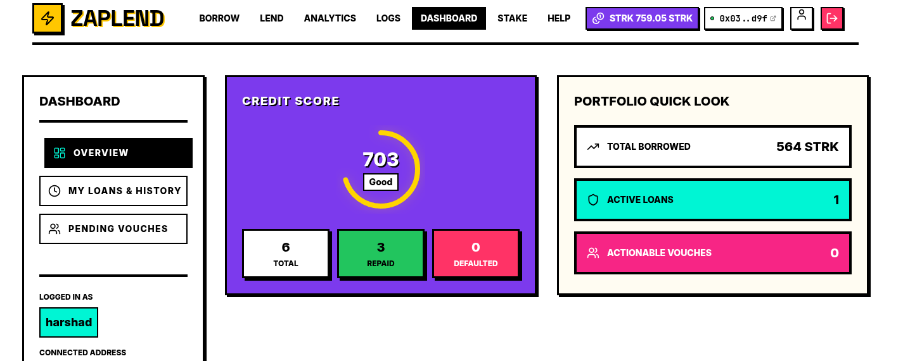
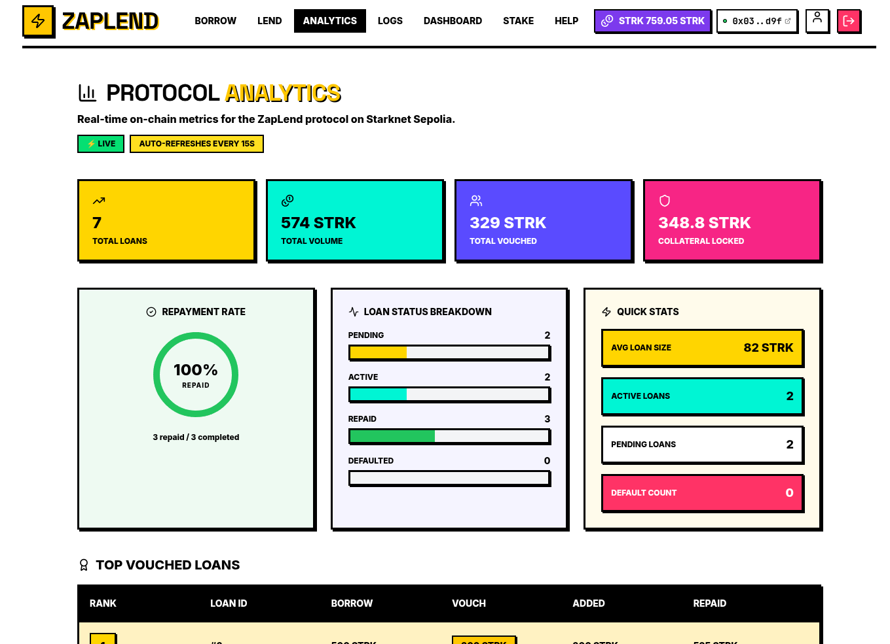
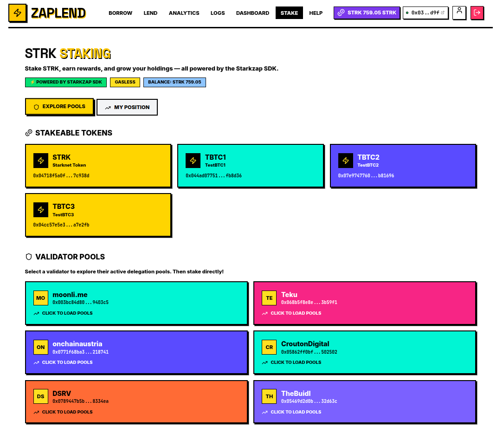

# ZapLend — Social Collateral P2P Lending

> Borrow with less collateral when friends vouch for you. Trust-based lending powered by Starknet and [Starkzap SDK](https://github.com/keep-starknet-strange/starkzap).

ZapLend re-imagines DeFi peer-to-peer lending by introducing **"Social Collateral."** Borrowers can reduce their required capital by inviting friends to essentially co-sign their loan natively on-chain.



---

## 🏆 Starkzap Developer Challenge Submission

**Challenge Category:** "What if [insert SaaS/mobile app] had Bitcoin, stablecoins or DeFi features?"

ZapLend brings **social trust and P2P lending** to Starknet DeFi, combining traditional lending mechanics with social graph validation. This submission demonstrates the power of the Starkzap SDK for building consumer-friendly DeFi applications.

### Starkzap SDK Modules Used

| Module | Implementation |
|--------|----------------|
| **Wallets** | Cartridge Controller integration via `OnboardStrategy.Cartridge` for seamless, extension-less onboarding |
| **Gasless Transactions** | Paymaster-sponsored vouching transactions — friends can vouch without paying gas fees |
| **Staking** | Native STRK staking via `wallet.stake()`, `claimPoolRewards()`, and validator pool exploration |

### Links
- **Live Demo App**: [https://zaplend.vercel.app/](https://zaplend.vercel.app/)
- **GitHub Repository**: [harshad-dhokane/ZAPLEND](https://github.com/harshad-dhokane/ZAPLEND)
- **Technical Guide**: [Read GUIDE.md](./GUIDE.md)
- **Contract (Sepolia)**: [View on Voyager](https://sepolia.voyager.online/contract/0x04d9043def8f91491a91337fe81695c5692cc98403818b6d0029ad7105cb66f5)

---

## 🌟 Features & Application Flow

ZapLend features a vibrant, Neo-Brutalism UI that makes complex DeFi interactions feel like a modern consumer app.

### 1. Landing Page
A bold, eye-catching hero section introducing the concept of Social Collateral lending.


### 2. The Borrow Request
A user connects their wallet (via Cartridge) and submits a loan request. Normally, they would need 120% collateral. In ZapLend, they can set a **Social Collateral Target**.
- They put down a baseline deposit.
- The rest of the required collateral is delegated to their social circle.



### 3. Loan Marketplace
Explore active and pending loans in the marketplace. Filter by status (Active, Pending, Repaid) and search for specific borrowers.



### 4. Shareable Vouching
Each loan has a unique shareable link at `/loan/[id]`. Friends can vouch via:
- Direct link sharing
- QR code generation
- Social media (Twitter, Telegram, WhatsApp)



### 5. Friends Vouch (Gasless!)
Friends click **Vouch** and stake their own STRK towards the borrower's goal. Thanks to Starkzap's Paymaster integration, this transaction is completely gasless for the voucher.



### 6. Dashboard & Activity Feed
Your personal hub for tracking everything:
- Overview of total borrowed and active vouches
- Make payments on active loans
- View repayment history
- Live activity feed showing global protocol events



### 7. Analytics & Credit Profile
A robust Analytics dashboard tracks aggregate platform metrics:
- Total Value Locked (TVL)
- Active loans and total borrowers
- Top loans by collateral vs repaid value
- Credit score distribution



### 8. STRK Staking (Powered by Starkzap)
While your STRK waits to be used, stake it directly within ZapLend:
- Browse validator pools from SDK presets
- Stake STRK with one click using `wallet.stake()`
- Track rewards in real-time
- Claim rewards anytime
- Two-step unstaking with cooldown period



### 9. Contract Logs (Transparency)
Real-time event logs directly from the ZapLend smart contract:
- LoanCreated events
- VouchAdded events
- LoanActivated, LoanRepaid, LoanDefaulted
- Full on-chain transparency


---

## 🏗️ Architecture

### Smart Contracts (Cairo)
Written entirely in modern Cairo 2.x.

| Contract | Purpose | Address |
|----------|---------|---------|
| `Loan` | Loan creation, collateral logic, repayment, liquidation | `0x04d9043def8f91491a91337fe81695c5692cc98403818b6d0029ad7105cb66f5` |

### Frontend (Next.js + Starkzap)
| Layer | Technology |
|-------|------------|
| Framework | Next.js 15 (App Router) |
| Styling | Tailwind CSS + Neo-Brutalism design system |
| State | React Query (TanStack Query) |
| Wallet | Starkzap SDK (`starkzap`) with Cartridge Controller |
| Network | Starknet Sepolia |

### Key Hooks & Integrations

```typescript
// Wallet Connection via Starkzap
const { wallet, isConnected, connect } = useStarkzap();

// Staking via Starkzap SDK
const { stake, claimRewards, exitPoolIntent, exitPool } = useStakingActions();

// Contract Events
const { data: logs } = useContractLogs(); // Real-time on-chain events
```

---

## 🚀 Quick Start (Local Development)

### Prerequisites
- Node.js 18+
- npm or yarn
- Starknet wallet (via Cartridge Controller)

### Frontend Setup

```bash
# Clone the repository
git clone https://github.com/harshad-dhokane/ZAPLEND.git
cd ZAPLEND

# Install dependencies
cd frontend
npm install

# Configure environment
cp .env.example .env.local
# Edit .env.local with your contract addresses

# Run development server
npm run dev
```

Open [http://localhost:3000](http://localhost:3000) to see the app.

### Environment Variables

```bash
NEXT_PUBLIC_LOAN_CONTRACT_ADDRESS=your_contract_address
NEXT_PUBLIC_STRK_TOKEN_ADDRESS=your_strk_token_address
NEXT_PUBLIC_STARKZAP_NETWORK=sepolia
```

---

## 📱 Application Pages

| Page | Route | Description |
|------|-------|-------------|
| Home | `/` | Landing page with hero section |
| Borrow | `/borrow` | Create new loan requests |
| Lend | `/lend` | Marketplace of all loans |
| Loan Detail | `/loan/[id]` | Individual loan page with vouching |
| Dashboard | `/dashboard` | Personal borrowing/lending overview |
| Analytics | `/analytics` | Platform-wide metrics |
| Staking | `/stake` | STRK staking via Starkzap |
| Contract Logs | `/logs` | Real-time on-chain events |
| Help | `/help` | FAQs, glossary, and guides |

---

## 🎨 Design System

ZapLend uses a **Neo-Brutalism** design language:
- Bold, high-contrast colors (`#FFD500`, `#00F5D4`, `#F72585`, `#5A4BFF`)
- Heavy black borders (3px-6px)
- Hard shadows with offset effects
- Uppercase typography for headings
- Monospace fonts for data/code

---

## 🔐 Security & Trust

- **Session Persistence**: Secure session storage with auto-reconnect
- **Policy-based Permissions**: Cartridge policies for contract methods
- **On-chain Transparency**: All events publicly verifiable
- **Credit Scoring**: On-chain reputation system (300-1000 score)

---

## 📄 License

MIT License

Copyright (c) 2025 ZapLend

Permission is hereby granted, free of charge, to any person obtaining a copy
of this software and associated documentation files (the "Software"), to deal
in the Software without restriction, including without limitation the rights
to use, copy, modify, merge, publish, distribute, sublicense, and/or sell
copies of the Software, and to permit persons to whom the Software is
furnished to do so, subject to the following conditions:

The above copyright notice and this permission notice shall be included in all
copies or substantial portions of the Software.

THE SOFTWARE IS PROVIDED "AS IS", WITHOUT WARRANTY OF ANY KIND, EXPRESS OR
IMPLIED, INCLUDING BUT NOT LIMITED TO THE WARRANTIES OF MERCHANTABILITY,
FITNESS FOR A PARTICULAR PURPOSE AND NONINFRINGEMENT. IN NO EVENT SHALL THE
AUTHORS OR COPYRIGHT HOLDERS BE LIABLE FOR ANY CLAIM, DAMAGES OR OTHER
LIABILITY, WHETHER IN AN ACTION OF CONTRACT, TORT OR OTHERWISE, ARISING FROM,
OUT OF OR IN CONNECTION WITH THE SOFTWARE OR THE USE OR OTHER DEALINGS IN THE
SOFTWARE.

---

## 🙏 Acknowledgments

- [Starkzap SDK](https://github.com/keep-starknet-strange/starkzap) by Keep Starknet Strange
- [Cartridge Controller](https://cartridge.gg) for seamless wallet experience
- [Starknet](https://starknet.io) for the L2 infrastructure
